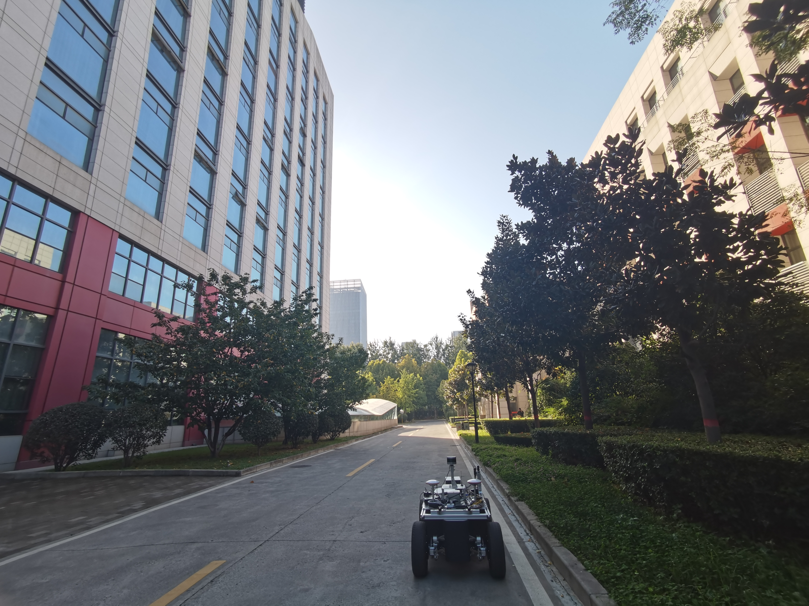
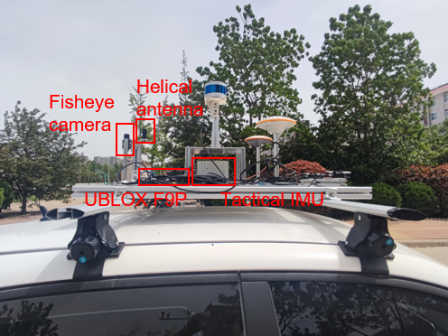

# NLOS-Datasets
### An efficient GNSS NLOS signal identification and processing method using random forest and factor analysis with visual label

This repository is the usage page of the [NLOS-Dataset](https://pan.baidu.com/s/1_60_UDiY8iKDJV8ZZmeGZw)（ 2zfo ）. The massive Global Navigation Satellite System (GNSS) users and frequent positioning demands in cities, as well as complex urban scenarios, pose many challenges to the accuracy and reliability of precise positioning. Since urban environments are prone to GNSS None-Line-of-Sight (NLOS) signals with large ranging errors, the NLOS signal identification and processing are of great importance. The UrbanNav dataset wishes to provide a challenging data source to the community to further accelerate the study of accurate and robust positioning in challenging urban canyons. 

  

**The NLOS-Datasets contains three sets of data**
 - one dynamic vehicle dataset recorded on April 15th, 2023;
 - two static dataset recorded on 10 23th, 2023;
 - one pedstrain dataset recorded on 10 22th, 2023.
  
**Sensor setups**
The on-board platform is equipped with the following sensors:
 - a low-cost UBLOX F9P receiver;
 - a FLIR fisheye camera BFS-PGE-16S2 facing the sky;
 - a tactical INS StarNeto XW-GI7660.
 - 
**Results and codes**
The results of our calculations consist of:
 - the identification result of five machine learings;
 - the PPP results with and without optimization;
 - all the codes of the programs.

  

**The outer lever arm distance**
XWYD-UBLX  

Right -0.312 Front: -0.393 Upper: 0.232
